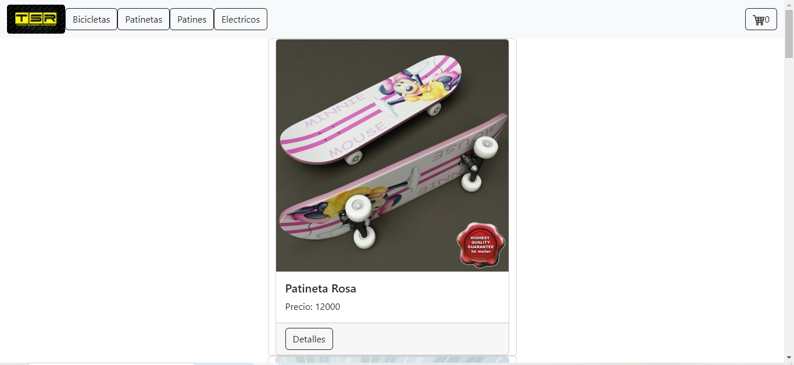

# Todo Sobre Ruedas

**Deploy**: https://majestic-malasada-8ea86e.netlify.app

**Imagen demo**

*Todo sobre ruedas* es una pagina de venta de vehiculos sobre ruedas no motirizados y electricos

Realizado por: Roberto Millan [github](https://github.com/RobertoJMC)

### CARACTERISTICAS

- Consume principalmente firestore donde se encuentra el listado de productos
- Filtrado por **categorías** de items.
- Uso de **context** para los productos agregados al carrito
- Uso de **react_router_dom** para la navegacion
- Uso de **bootstrap** para los estilos
- Version: 1.0.0

### HERRAMIENTAS UTILIZADAS

- **React VITE**
- **Firebase**
- **React Context**

### COMO LO PRUEBO?

Clona este repo
Ejecuta npm i
Ejecuta npm run dev

Gracias por tu visita!
